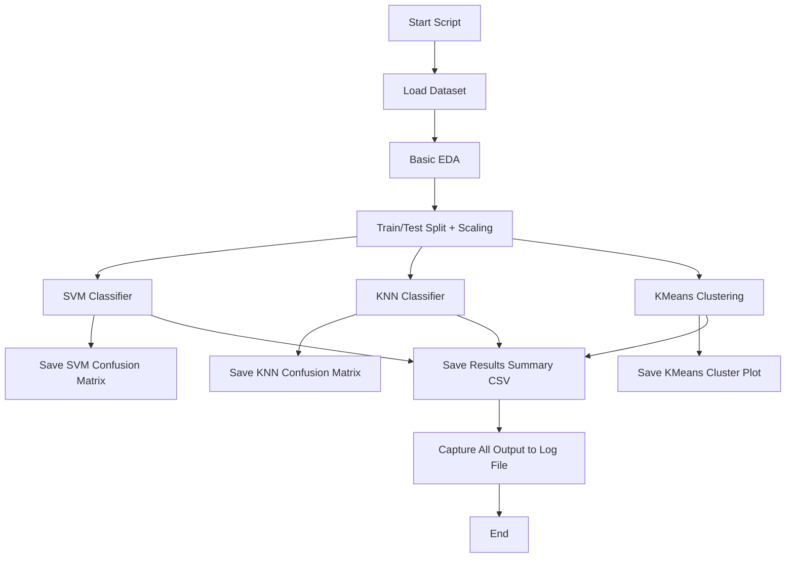

# 📊 Mobile Price Classification and Clustering Pipeline

This documentation describes the structure, workflow, and purpose of `main.py`, a Python script for data analysis, classification, and clustering on a mobile phone price dataset. The script implements end-to-end supervised and unsupervised learning, including Exploratory Data Analysis (EDA), SVM and KNN classifiers, and K-Means clustering.

---

## Overview

The script provides a comprehensive machine learning workflow:
- Loads and inspects a mobile price dataset.
- Preprocesses data with scaling and splitting.
- Trains and evaluates classification models (SVM and KNN).
- Performs and visualizes K-Means clustering.
- Saves results and logs output for reproducibility.

---

## Imports and Dependencies

The script relies on the following packages:

- `pandas` and `numpy` for data manipulation.
- `sklearn` for model selection, preprocessing, metrics, and learning algorithms.
- `matplotlib` for plotting.
- `pathlib` and `contextlib` for filesystem and output management.

---

## File Structure

| Section              | Description                                                |
|----------------------|------------------------------------------------------------|
| Data loading         | Reads the CSV dataset.                                     |
| EDA                  | Prints dataset stats, class balance, missing data.         |
| Preprocessing        | Splits data into train/test and scales features.           |
| SVM Classifier       | Trains, evaluates, and visualizes SVM results.             |
| KNN Classifier       | Trains, evaluates, and visualizes KNN results.             |
| K-Means Clustering   | Unsupervised learning and visualization.                   |
| Results Saving       | Stores summaries, confusion matrices, and logs.            |

---

## Data Loading

The following function loads a CSV into a Pandas DataFrame and checks for existence.

```python
def load_dataset(csv_path: str) -> pd.DataFrame:
    path = Path(csv_path)
    if not path.exists():
        raise FileNotFoundError(f"CSV file not found at {path.resolve()}")
    df = pd.read_csv(path)
    return df
```

---

## Exploratory Data Analysis (EDA)

The EDA function prints shape, columns, missing values, and class distribution.

```python
def basic_eda(df: pd.DataFrame) -> None:
    print("=== BASIC EDA ===")
    print("Shape:", df.shape)
    print("\nColumns:", df.columns.tolist())
    print("\nMissing values per column:\n", df.isnull().sum())
    print("\nClass distribution (price_range):\n", df["price_range"].value_counts())
```

---

## Data Preprocessing

Splitting the data into train/test sets and applying standard scaling ensures fair evaluation and model convergence.

```python
def train_test_split_scaled(df: pd.DataFrame):
    X = df.drop("price_range", axis=1)
    y = df["price_range"]
    X_train, X_test, y_train, y_test = train_test_split(
        X, y, test_size=0.2, random_state=42, stratify=y,
    )
    scaler = StandardScaler()
    X_train_scaled = scaler.fit_transform(X_train)
    X_test_scaled = scaler.transform(X_test)
    return X_train, X_test, y_train, y_test, X_train_scaled, X_test_scaled, scaler
```

- **Stratification** ensures class balance in splits.
- **StandardScaler** standardizes features (mean=0, std=1).

---

## SVM Classifier

Trains a Support Vector Machine and prints/saves evaluation metrics and confusion matrix.

```python
def train_evaluate_svm(X_train_scaled, X_test_scaled, y_train, y_test):
    svm_clf = SVC(kernel="rbf", C=1.0, gamma="scale", random_state=42)
    svm_clf.fit(X_train_scaled, y_train)
    y_pred = svm_clf.predict(X_test_scaled)
    acc = accuracy_score(y_test, y_pred)
    print("\n=== SVM Results ===")
    print("Accuracy:", acc)
    print("\nClassification report:\n", classification_report(y_test, y_pred))
    cm = confusion_matrix(y_test, y_pred)
    disp = ConfusionMatrixDisplay(confusion_matrix=cm)
    disp.plot()
    plt.title("SVM Confusion Matrix")
    plt.tight_layout()
    plt.savefig("results/svm_confusion_matrix.png", dpi=300)
    plt.close()
    return svm_clf, acc, cm
```

---

## KNN Classifier

Trains a K-Nearest Neighbors classifier and evaluates similarly to SVM.

```python
def train_evaluate_knn(X_train_scaled, X_test_scaled, y_train, y_test, k: int = 5):
    knn_clf = KNeighborsClassifier(n_neighbors=k)
    knn_clf.fit(X_train_scaled, y_train)
    y_pred = knn_clf.predict(X_test_scaled)
    acc = accuracy_score(y_test, y_pred)
    print(f"\n=== KNN Results (k={k}) ===")
    print("Accuracy:", acc)
    print("\nClassification report:\n", classification_report(y_test, y_pred))
    cm = confusion_matrix(y_test, y_pred)
    disp = ConfusionMatrixDisplay(confusion_matrix=cm)
    disp.plot()
    plt.title(f"KNN Confusion Matrix (k={k})")
    plt.tight_layout()
    plt.savefig(f"results/knn_confusion_matrix_k{k}.png", dpi=300)
    plt.close()
    return knn_clf, acc, cm
```

---

## K-Means Clustering

Clusters feature data into groups and relates clusters to `price_range`. Also, visualizes clusters using PCA.

```python
def run_kmeans_clustering(df: pd.DataFrame, scaler: StandardScaler, n_clusters: int = 4):
    feature_cols = [col for col in df.columns if col != "price_range"]
    X = df[feature_cols].values
    X_scaled = scaler.fit_transform(X)
    kmeans = KMeans(n_clusters=n_clusters, random_state=42, n_init=10)
    cluster_labels = kmeans.fit_predict(X_scaled)
    df_clusters = df.copy()
    df_clusters["cluster"] = cluster_labels
    sil_score = silhouette_score(X_scaled, cluster_labels)
    print("\n=== K-Means Clustering Results ===")
    print("Silhouette score:", sil_score)
    print("\nCluster vs price_range contingency table:")
    print(pd.crosstab(df_clusters["cluster"], df_clusters["price_range"]))
    from sklearn.decomposition import PCA
    pca = PCA(n_components=2, random_state=42)
    X_pca = pca.fit_transform(X_scaled)
    plt.figure()
    plt.scatter(
        X_pca[:, 0], X_pca[:, 1], c=cluster_labels, alpha=0.6, edgecolor="k",
    )
    plt.xlabel("PC1")
    plt.ylabel("PC2")
    plt.title("K-Means Clusters (PCA 2D Projection)")
    plt.tight_layout()
    plt.savefig("results/kmeans_pca_clusters.png", dpi=300)
    plt.close()
    return kmeans, df_clusters, sil_score
```

- **Silhouette score** evaluates clustering quality.
- **PCA** reduces features to 2D for visualization.

---

## Main Workflow

The `main()` function orchestrates the entire process:

```python
def main():
    csv_path = "data/train.csv"
    Path("results").mkdir(exist_ok=True)
    df = load_dataset(csv_path)
    basic_eda(df)
    (
        X_train, X_test, y_train, y_test,
        X_train_scaled, X_test_scaled, scaler,
    ) = train_test_split_scaled(df)
    svm_clf, svm_acc, svm_cm = train_evaluate_svm(
        X_train_scaled, X_test_scaled, y_train, y_test
    )
    knn_clf, knn_acc, knn_cm = train_evaluate_knn(
        X_train_scaled, X_test_scaled, y_train, y_test, k=5
    )
    kmeans, df_clusters, sil_score = run_kmeans_clustering(df, scaler, n_clusters=4)
    summary = {
        "model": ["SVM", "KNN", "KMeans"],
        "accuracy_or_silhouette": [svm_acc, knn_acc, sil_score],
    }
    summary_df = pd.DataFrame(summary)
    summary_df.to_csv("results/model_summary.csv", index=False)
    print("\nSaved results/model_summary.csv")
```

---

## Output Capture and Logging

To ensure reproducibility, all terminal output (EDA, metrics, logs) is captured to a file:

```python
if __name__ == "__main__":
    Path("results").mkdir(exist_ok=True)
    log_path = Path("results") / "viva_terminal_output.txt"
    with open(log_path, "w", encoding="utf-8") as f, redirect_stdout(f):
        main()
    print(f"Run complete. Terminal output saved to {log_path}")
    main()
```

---

## Workflow Diagram

This flowchart outlines the process from reading data to saving results:



---

## Model Results and Artifacts

- **Confusion matrices** for SVM and KNN in `results/`
- **Cluster visualization** for KMeans in `results/`
- **Summary CSV**: Aggregates model metrics and is saved in `results/model_summary.csv`
- **Output log**: Everything printed is captured in `results/viva_terminal_output.txt`

---

## Example Directory Layout

```
project-root/
│
├── main.py
├── data/
│   └── train.csv
└── results/
    ├── svm_confusion_matrix.png
    ├── knn_confusion_matrix_k5.png
    ├── kmeans_pca_clusters.png
    ├── model_summary.csv
    └── viva_terminal_output.txt
```

---

## Key Takeaways

- The script is a complete ML pipeline for mobile price prediction and clustering.
- It is fully reproducible: all outputs and results are saved to files.
- Visualization artifacts (plots) and metrics are auto-generated.
- Designed for extensibility: add new models or modify data paths as needed.

---

```card
{
    "title": "Best Practices",
    "content": "Always check results/ for output files and logs after running the script. Review summary CSV for model comparisons."
}
```

---

## Extending and Customizing

- To try other classifiers, add function(s) similar to `train_evaluate_svm`/`train_evaluate_knn`.
- For more clusters or other clustering algorithms, modify `run_kmeans_clustering`.
- Data path and output folders can be changed by adjusting `csv_path` and `results/`.

---

## Limitations

- Assumes a clean, well-structured CSV at `data/train.csv`.
- Focused on classification and clustering; no regression or deep learning included.
- Results depend on feature engineering and data quality.

---

## Summary

This script is an effective tool for both educational and practical use in data science, providing a full workflow from data loading to model evaluation and result storage for a mobile price dataset.

---